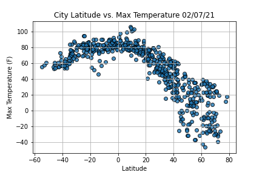
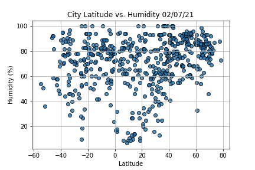
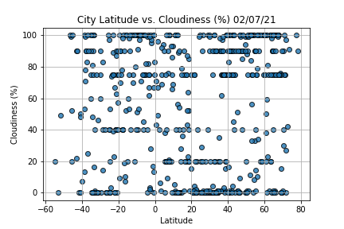
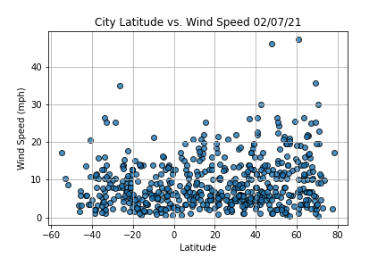
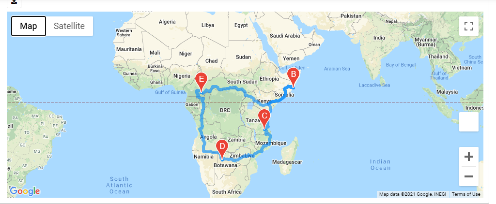
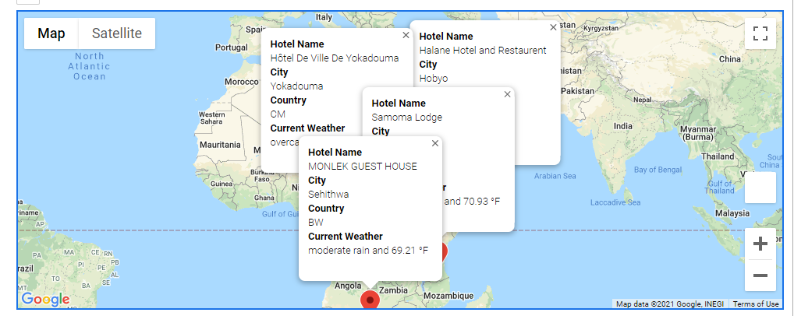

# World Weather Analysis and Travel Apps

## Project Overview
"Plantmytrip" is a technology company that specializes in internet services for hotel and lodging industries. It creates applications that provides user interface , colelct and present data via searching . Customer can use the searching enging to find the location and plan their travel based on their preferred temprature range.
### Weather Analysis:

- Objective is to select 500 randim cities, theire lat and long , pull weather data from openmapapi and retireve json data for these citiies.
- Pull weather data from json into a dataframe.
- Use matplotlib to create a series of scatted plot to show the relationship between lat and variet of weather prarmeter
- Perform statistical calcution using regression analyis for northern and southern hemisphere
- Predict the best time of year to plan the trip
- Export, clean and use wether data to choose best cities for vacation best on certain weather criteira and then map these citites using gmpas and google places api.
- Find travelers ideal vacation spot based on user preferred temperature critera

Purpose: PlanMyTrip will use the data to recommend ideal hotels based on clients' weather preferences.
Method: Create a Pandas DataFrame with 500 or more of the world's unique cities and their weather data in real time. 	This process will entail collecting, analyzing, and visualizing the data.

### Challenge:
- Retrieve Weather Data
- Create a Customer Travel Destinations Map
- Create a Travel Itinerary Map

## Resources
- Data source: 
     - Openweather API
     - Google Places (serarch nearby) API
    
- Software: Anaconda Jupyter notebook Python 3.7 and panda , Pythong gmaps,  requests modules and citipy
 
## Solution
### Weather Analysis:

Weather analysis by latitude and longitute for randomly selected cities.

Jupyter notebook:[Weather analysis](WeatherPy.ipynb)
Output File: [Weather data from weather analysis](weather_data/cities.csv)
Map: differet maps.

#### Latitude vs Temperature

#### Latitude vs Humidity

#### Latitude vs Cloudiness

#### Latitude vs Wind Speed

### Weather Database:
  Generated random latitudes and longitudes . Then find the nearby cities using python citipy module. 
  For all the cities , gather the weather information using openweather api.
  Folder : [weather_database](weather_database/)
  Jupyter notebook: [weather database noteboook](weather_database/Weather_Database.ipynb)
  output file: [Weather data with weather description](weather_database/WeatherPy_Database.csv)
  
### Vacation searching tool
  This solution allow user to enter temeprate range as input. And then provide list of citiies that falls withing the range in a google map.
   Folder : [Vacation Search ](Vacation_Search/)
  Jupyter notebook: [Vacation Search noteboook](Vacation_Search/Vacation_Search.ipynb)
  output file: [Vacation data with weather](Vacation_Search/WeatherPy_vacation.csv)
  
#### Vacation search map:

### Vacation itinerary tool
  This solution allow user to enter temeprate range as input. And then provide list of citiies that falls withing the range in a google map.
   Folder : [Vacation Itinerary ](Vacation_Itinerary/)
  Jupyter notebook: [Vacation Search noteboook](Vacation_Itinerary/Vacation_Itinerary.ipynb)
  
  #### Itinerary Map:
  
  
  
  #### Vacation search with markers map:
  
  
  
  
